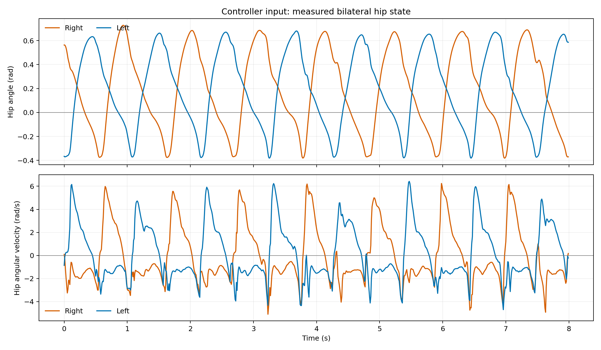
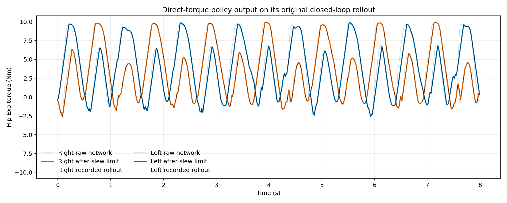
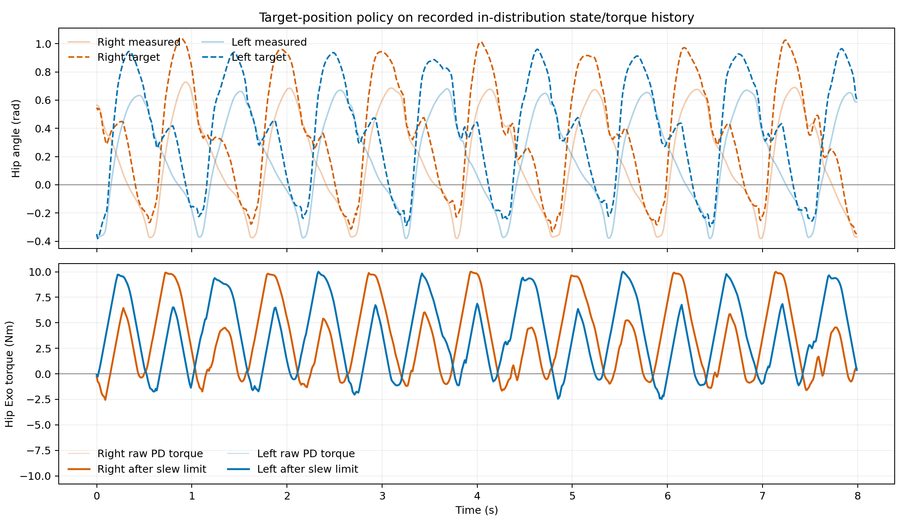

# Flat-ground closed-loop validation data

This package records the in-distribution flat-ground trajectory used to validate
the two Exo models in the parent directory.

## Coordinate convention

The network input at 100 Hz is:

```text
[right hip angle, left hip angle, right hip angular velocity, left hip angular velocity]
```

- Angles are in radians and angular velocities are in rad/s.
- Positive angle and velocity mean hip flexion: lifting the thigh forward.
- Network output order is `[right hip torque, left hip torque]` in Nm.
- Positive torque is hip-flexion torque.
- A hardware sign is correct when lifting either thigh produces a positive angle.

The exact controller interface is shown in `../inference_example.py`.

## Files

- `flat22_closed_loop_trace.csv`: readable 800-frame (8 s) trajectory with the
  current hip state and both controllers' intermediate/final outputs.
- `flat22_closed_loop_model_io.npz`: the same data plus complete 32-D direct
  model inputs and bilateral 48-D target-PD model inputs, before and after
  normalization.
- `01_input_hip_state.png`: the four measured state inputs.
- `02_direct_torque_output.png`: raw direct-network torque, slew-limited torque,
  and the torque saved by the original simulator rollout.
- `03_target_pd_output.png`: measured/target hip angles and resulting PD torque.

The direct controller replay matches the saved simulator torque with an RMSE of
`6.55e-7 Nm` and a maximum absolute error of `2.15e-6 Nm`.

The original direct controller completed this trajectory in closed loop. The
target-PD policy was fitted from this same trajectory; its plot and NPZ inputs
use the recorded in-distribution hip-state and applied-torque history.

## Important controller fix

`NN_PC_Controller.py` previously converted IMU degrees to radians in the main
loop and then multiplied the values by `pi/180` again inside neural inference.
The second conversion has been removed. With the old code, angles and angular
velocities reaching both networks were about 57.3 times too small.






